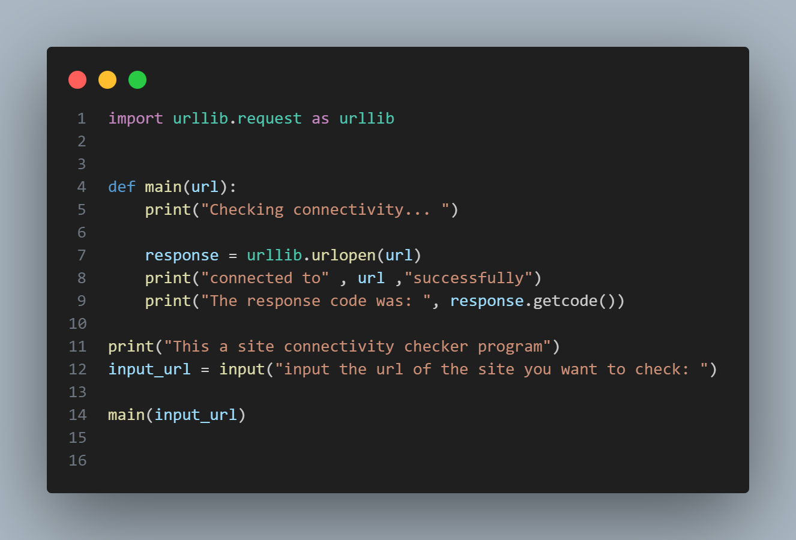

# Site-connectivity-checker

There isn't much code in creating a s site-connectivity-checker. You need to have python downloaded and urllib. And you just have to follow these steps:

1. import urllib(import urllib.request as urllib ), put in .request as urllib, so you want have to put in urllib.urllib in your code, you will just type 'url'.
2. Create a def function with the function(main(url)), put in 'url' in the bracket of main(). Print something like(print("Checking connectivity)), so the user will know that the program is working. 
3. Create a var(response), then put in 'urllib.urlopen(url)'. print(print("connected to" , url ,"successfully")), so the user will know that it worked. print(print("The response code was: ", response.getcode())), so the user will the response of the url they typed in.
4. print(print(("This a site connectivity checker program"))), You may think that this is what i am meant to print first, but if i had printed this first, everything i printed in the def() function will print out before this one
5. Create a var(input_url), then put in an input function, then ask the user a question like(input_url = input("input the url of the site you want to check: ")). Then print out all the def function by typing 'main(input_url)'

Thats all for the site-connectivity checker, if you don't understand everything i typed out, look at the image;
